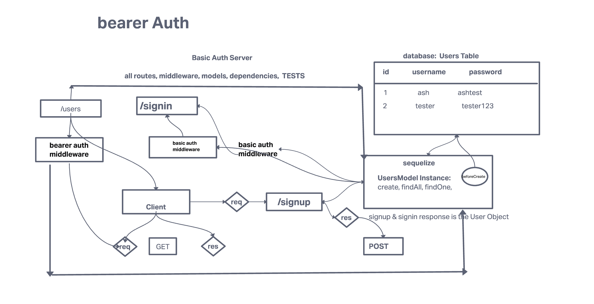

# bearer-auth

Author: Ashwini Uppal

Used a "Bearer Token" to re-authenticate with a server following a successful login.

All the tests are passing.
Tests report [tests](https://github.com/ashuppal/bearer-auth/pulls?q=is%3Apr+is%3Aclosed)

## .env requirements

PORT - 3000
SECRET

